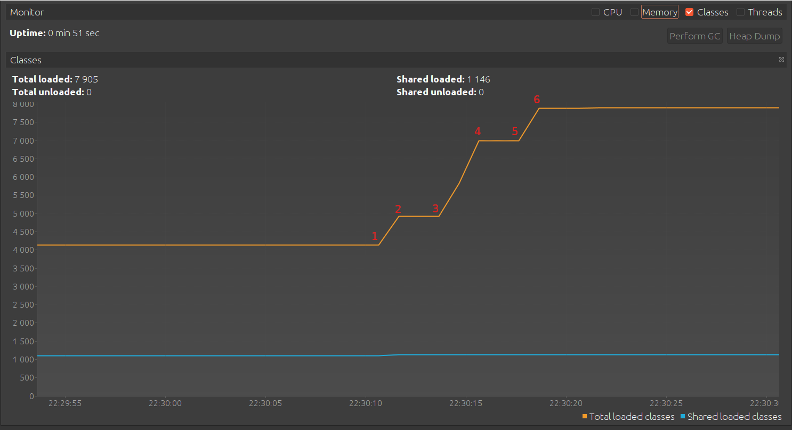
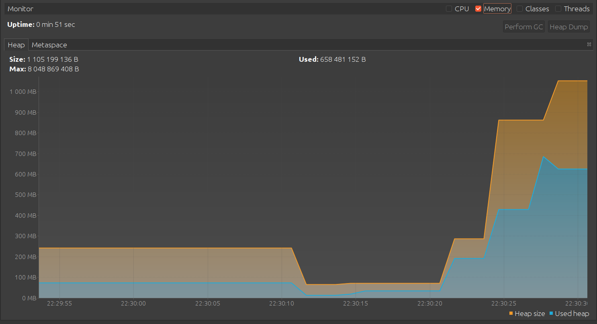

# [JvmExperience](https://github.com/kirrag/jvm-visualvm-experience)

* **[INFO]** *--- exec-maven-plugin:3.1.0:java (default-cli) @ JvmExperience ---*

* Please open 'ru.netology.JvmExperience' in VisualVm - **[Создание фрейма main() в стеке] [0]**

* 22:30:11.053516494: loading io.vertx - **[Начало загрузки классов библиотеки io.vertex в Metaspace] [1]**

* 22:30:11.363026227: loaded 529 classes - **[Загружено 529 классов бибилиотеки io.vertex в Metaspace] [2]**

* 22:30:14.366397028: loading io.netty - **[Начало загрузки классов бибилиотеки io.netty в Metaspace] [3]**

* 22:30:14.831367790: loaded 2117 classes - **[Загружено 2117 классов бибилиотеки io.netty в Metaspace] [4]**

* 22:30:17.832271761: loading org.springframework - **[Начало загрузки калассов библиотеки org.springframework в Metaspace] [5]**

* 22:30:18.018494702: loaded 869 classes - **[Загружено 869 классов бибилиотеки org.springframework в Metaspace] [6]**

* 22:30:21.018909037: now see heap - **[Теперь посмотрим на heap] [7]**

* 22:30:21.019548261: creating 5000000 objects - **[В heap начали создаваться 5 млн. объектов] [8]**

* 22:30:21.205998569: created - **[В heap создано 5 млн. объектов] [9]**

* 22:30:24.206923507: creating 5000000 objects - **[В heap начали создаваться дополнительно 5 млн. объектов] [10]**

* 22:30:24.340140019: created - **[В heap дополнительно создано 5 млн. объектов] [11]**

* 22:30:27.387823456: creating 5000000 objects - **[В heap начали создаваться дополнительно 5 млн. объектов] [12]**

* 22:30:27.587210726: created - **[В heap дополнительно создано 5 млн. объектов] [13]**
